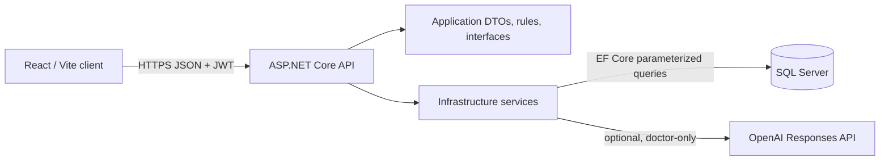

# Architecture

The Hospital Management System is a modular monolith: React/Vite is the browser client, ASP.NET Core 8 is the API boundary, and SQL Server is the source of truth.

`Hospital.Api` owns HTTP, CORS, authentication, authorization, response headers, and exception translation. `Hospital.Application` owns contracts and shared workflow rules. `Hospital.Infrastructure` owns EF Core, SQL-backed services, token issuance, notifications, and the isolated AI adapter. Database schema is versioned SQL; EF migrations are deliberately not used.

## Request path

1. The client sends a request with a bearer token.
2. API authentication validates issuer, audience, signing key, and expiration.
3. Role attributes and service ownership checks authorize the request.
4. Services apply lifecycle rules and persist through EF Core.
5. API responses use no-store and security headers.

## Role matrix

| Capability | Patient | Doctor | Administrator |
|---|---:|---:|---:|
| Register/login and own profile | Yes | Seeded login/profile | Seeded login/profile |
| Browse departments/doctors | Yes | Yes | Yes |
| Request/view own appointments | Yes | No | No |
| Review assigned appointments | No | Yes | No |
| Record treatment / generate bill | No | Yes, assigned only | No |
| View treatment history / bills | Own records only | Related patients only | No direct clinical history endpoint |
| AI history summary | No | Related patients only | No |
| Manage departments/accounts | No | No | Yes |

## Key design decisions

- Patient ownership and doctor–patient relationships are enforced in services, not merely hidden in the UI.
- Appointment, treatment, and bill state rules are centralized in `AppointmentWorkflowRules`.
- Record plus notification changes use a single EF Core transaction.
- List endpoints use bounded query pagination (`page`, `pageSize`; default 25, maximum 100).
