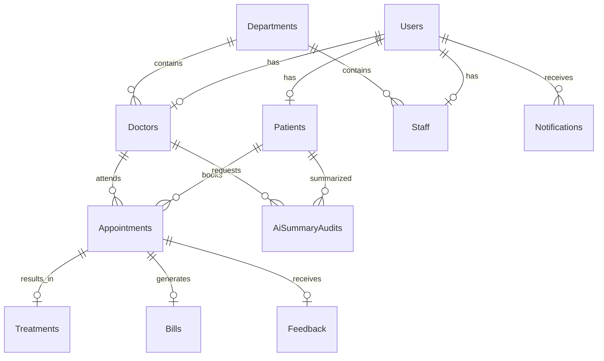

# Database

SQL Server schema scripts live under `database/migrations` and execute in numeric order through `database/scripts/InitializeDatabase.sql`. The initializer is for a clean database; rerunning individual create scripts against an existing schema is intentionally not a migration mechanism.



## Integrity and performance

- Unique email, medical-record number, doctor license, and doctor/appointment-slot constraints prevent duplicates.
- Foreign keys tie treatment, bills, and feedback to the correct appointment/patient/doctor relationship.
- `IX_Appointments_DoctorId_AppointmentDateTime_Status` supports doctor schedule/status queries.
- Treatment history, notifications, and AI audit tables use indexes matching their ordered retrieval paths.

## Local commands

See [database/README.md](../database/README.md) for initialization. Validate the active database with:

```powershell
& $sqlcmd -S localhost -E -C -b -i database/scripts/ValidateDatabase.sql
```

Use fictional seed data only. The SQL scripts must not be run against a production database without a reviewed deployment plan and backup.
